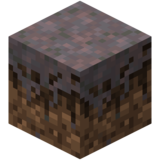

# MATE [](https://crowdin.com/project/mate-launcher) [](https://opensource.org/licenses/MIT) 
> Minecraft лаунчер, использующий Electron

> A Minecraft Launcher on Electron 

# INFO
Currently, project is paused on develop. / В настоящий момент проект заморожен.

Project needs JavaScript, Node.JS, Vue.JS, ElectronJS devs / Проект нуждается в разработчиках JS, Node.JS, Vue.JS, ElectronJS

Join the [Discord Server](https://discord.gg/ntS5f2J) and ping @redcarti#0070 to more info / Присоединитесь к [дискорду](https://discord.gg/ntS5f2J) и пинганите @redcarti#0070 для дальнейшей информации

# Contributing
* Лаунчер/Launcher:
```bash
$ git clone https://github.com/matelauncher/mate
$ cd mate
$ npm i
$ npm run electron:serve
```

* [Crowdin](https://crowdin.net/project/mate-launcher)

# Bugs/Баги
[Issues](https://github.com/MATElauncher/MATE/issues)

# Credits
[matecore](https://github.com/matelauncher/matecore) - Главная библиотека MATE Launcher

[Vue](https://vuejs.org) - js-фреймворк

[Electron](https://www.electronjs.org) - приложение

[TailwindCSS](https://tailwindcss.com) - css-фреймворк 
